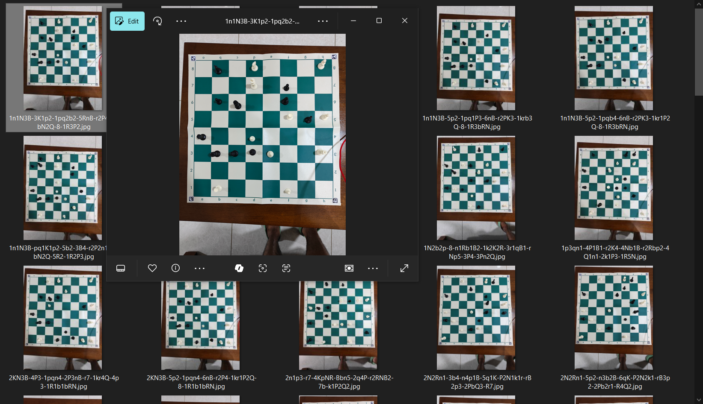
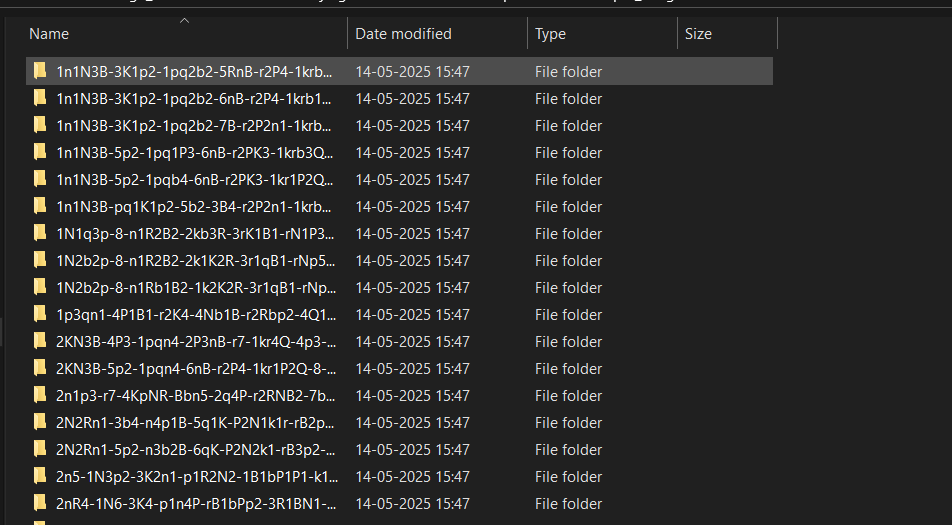
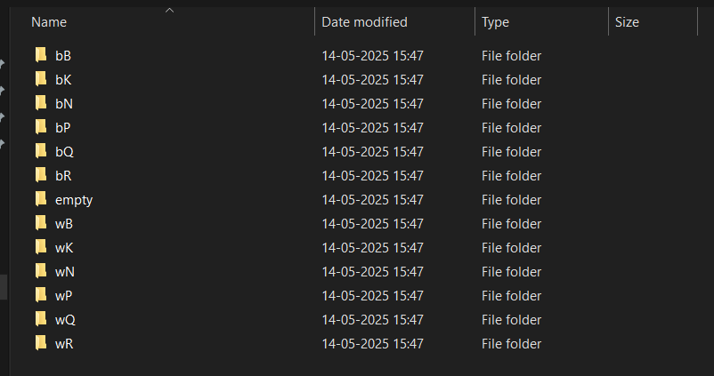
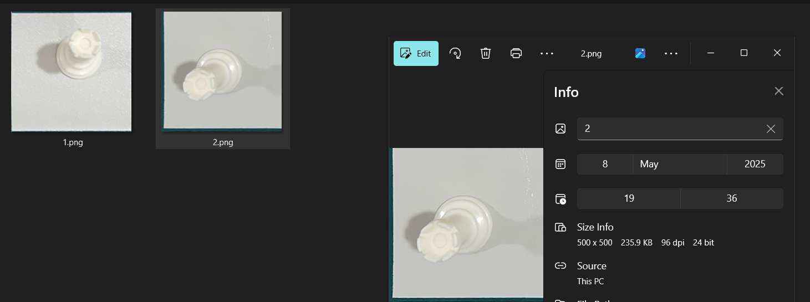
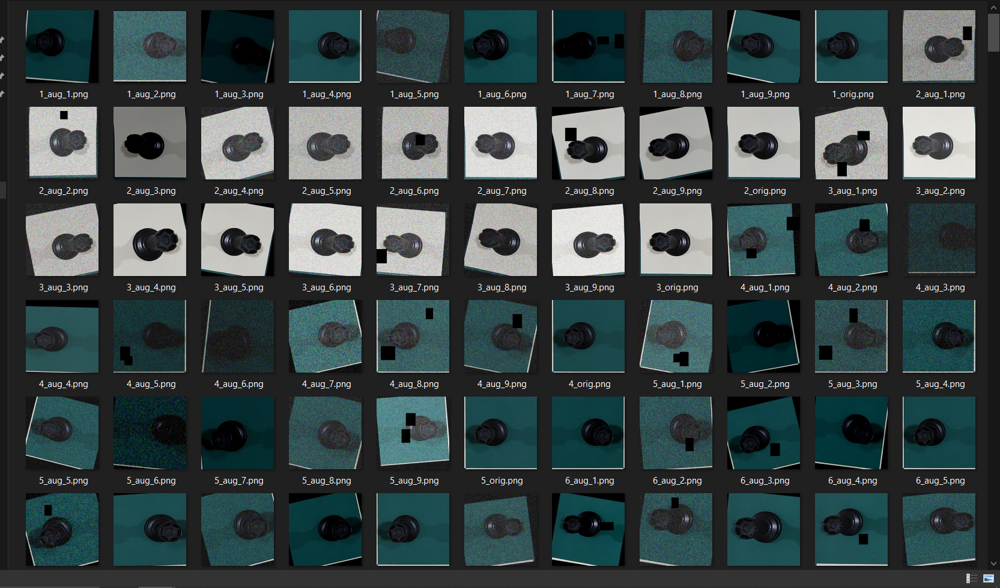
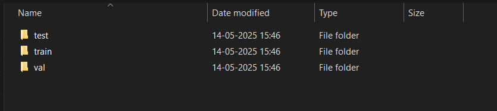
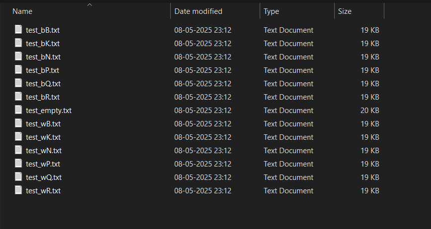

# Pipeline for Creation of Dataset and Training of CNN

If you wish to use or view the dataset that I collected and used, you can find it hosted on Kaggle here: [Kaggle Dataset Link](https://www.kaggle.com/datasets/harishekar/chess-board-state-detection-dataset)

Scripts used:
- capture_image.py: Used to retrieve the most recent image from your Camera Gallery on your android phone and saved on your local machine with the name of the fen of the chess board.
- split_top_down_images.py: Used to go through the folder containing all the full chess board images to split it into 64 images (one for each cell on the board) and have it automatically labelled according to the chess piece in that particular image/cell.
- random_select_images.py: Used to randomly select 100 images from each class to have an even distribution of each class in the dataset used for training.
- augment_dataset_10x.py: Used to multiply the dataset by 10x to increase the amount of training data.
- split_training_data.py: Used to split the final training data into a 80-10-10 split of train, test and validate.
- train_cnn_chess_piece_EfficientNet.ipynb: Used for training an EfficientNet model.
- image_to_fen.py: Used as a test after the model has been trained which takes a raw full chess board image as input and doess all the processing required for input into the trained model and outputs the full FEN of the chess board.

## Setup

Ensure Android Debug Bridge Utility (ADB) and Python3 is installed. You can use [this](https://www.howtogeek.com/125769/how-to-install-and-use-abd-the-android-debug-bridge-utility/) guide for installing ADB. For using ADB wirelessly, refer to the Read Me file in the main project folder.

Install the following libraries for python. I have also provided the pip commands for the same.

- OpenCV (cv2): Used for image processing tasks like reading images, color conversion, and ArUco marker detection. For ArUco marker functionality (as used in image_to_fen.py and split_top_down_images.py), you will need the contrib package as well. 
```
pip install opencv-python
```
```
pip install opencv-contrib-python
```
- Albumentations: Used for image augmentation in augment_dataset_10x.py.
```
pip install albumentations
```
- NumPy: Used for numerical operations, especially array manipulations in image processing and data handling.
```
pip install numpy
```
- PyTorch (torch): Purpose: Core machine learning library used for building and training the neural network model (train_cnn_chess_piece_EfficientNet.ipynb) and for model inference (image_to_fen.py). Please visit the Official PyTorch website to get the appropriate command for your setup. A typical CPU-only command is:
```
pip install torch torchvision torchaudio
```
- timm (PyTorch Image Models): Used in conjunction with PyTorch for EfficientNet model creation and loading (image_to_fen.py, train_cnn_chess_piece_EfficientNet.ipynb).
```
pip install timm
```
- torchvision: Part of the PyTorch ecosystem, provides datasets, model architectures, and image transformations for computer vision. Used for transforms in image_to_fen.py and train_cnn_chess_piece_EfficientNet.ipynb. It is usually installed with PyTorch. If not, or for a specific version: 
```
pip install torchvision
```
- Pillow (PIL): Python Imaging Library (Fork) used for opening, manipulating, and saving many different image file formats. Used in image_to_fen.py and train_cnn_chess_piece_EfficientNet.ipynb.
```
pip install Pillow
```
- python-chess: Used for chess logic, FEN parsing, and square manipulation in image_to_fen.py (and indirectly by other game logic files).
```
pip install python-chess
```
- scikit-learn (sklearn): Used for data splitting (e.g., train_test_split) in split_training_data.py and for evaluation metrics like classification_report in train_cnn_chess_piece_EfficientNet.ipynb.:
```
pip install scikit-learn
```
- Matplotlib: Used for plotting training history (loss and accuracy curves) in train_cnn_chess_piece_EfficientNet.ipynb.
```
pip install matplotlib
```
- tqdm: Used for creating progress bars, especially helpful during long training epochs in train_cnn_chess_piece_EfficientNet.ipynb.
```
pip install tqdm
```

I trained my model on Google Colab and hence I used the google.colab module, however you can leave this out if you are training on a local machine.

## Explanation of Flow of Pipeline

1. Capturing the Raw Data: Use the highest quality sensor on your camera to capture images. Ensure that the ArUco markers are setup properly as mentioned in the main file Read Me. When taking an image of the chess board, ensure that the chessboard fills most of the image and that it is a direct top down photo from the middle. You can use the following website: [Chess FEN Viewer](https://www.redhotpawn.com/chess/chess-fen-viewer.php), if you want to find the FEN for a given chess board state. Once you've taken a picture, run capture_image.py and enter the FEN in the terminal when prompted. This will save the image with the name as the FEN (only the chess pieces part) ('/' is saved as '-' due to windows file naming restrictions) in the folder you specified in the code. Repeat this process to collect as many images as you require.



2. Change the file paths in split_top_down_images.py to the local paths on your machine. The input directory is the folder of saved images from the last step. Run the script, this will take each image from the input folder, identify the ArUco markers, crops only the chessboard part (4000x4000 pixels) and crops it again to create 64 new images (each one of 500x500 pixels) (one of each cell) and create new folders in the output directory. Each folder holds the name of one of the images. Within each folder are 13 sub folders (1 empty, 6 for black and 6 for white pieces). The first letter in each folder name stands for the color and the second letter stands for the piece. So bB folder has all the images of cells with black bishop, wK for white king, bN for black knight and so on and so forth. The folder labelled empty is just for empty cells.
You will have as many folders in the output directory as there are images in the input directory and each folder will have 13 sub folders. Here is what the output folders would look like:







3. Edit the input directory in random_select_images.py to the output folder in the last step. This script will go through all the main folders, go into each sub folder and pick 1 of the images at random. This ensures that every single class is equally represented (assuming that in each image you've taken of the chessboard, there is atleast one of each piece present). This can be edited to randomly select as many images as you want, for my intents and purposes, I have chosen 1. 

4. Edit the original_data_dir path in augment_dataset_10x.py to the output directory from the last step and have a new path for the augmented_dat_dir to store the final dataset. This script is meant to 10x the data that you have collected by using the Albumentations library and applying various shifts, blurs, distortions, etc. This can be edited to your liking to lower or increase the amount of data created at the end or the types of distortions applied.



5. Edit the augmented_dat_dir path in split_training_data.py to the final output data directory in the previous step. This script simply splits the data into an 80-10-10 split of training, test and validation data. It does not copy the images into a new folder, instead it reads the files paths of each image and stores these under different text files to differentiate the train, test and validation splits. You can edit this path in the code to save where ever you want it to.





6. Open train_cnn_chess_piece_EfficientNet.py and update the index_files_dir path to same path that saved the txt files for test-train-val split from the previous step. Make a new folder to save the model in and put that path as model_dir in the code.
Run the code and it will start training based on the data you collected. I have also included a checkpointing system so that a checkpoint is saved every epoch so that even if training is interrupted, you can run the same code again and have it pick up from the last epoch. The final trained model will be saved as best_model_efficientnet_b0.pth in the folder path you specified earlier. You can also edit the code to use whatever model you wish to use as the rest of the pipeline that came before this would be exactly the same.

7. I have also included a test file to perform a small test on a sample image of your choosing. Edit the model path and the chess board image path in the image_to_fen.py script and run it. It will output the full FEN of the given image.