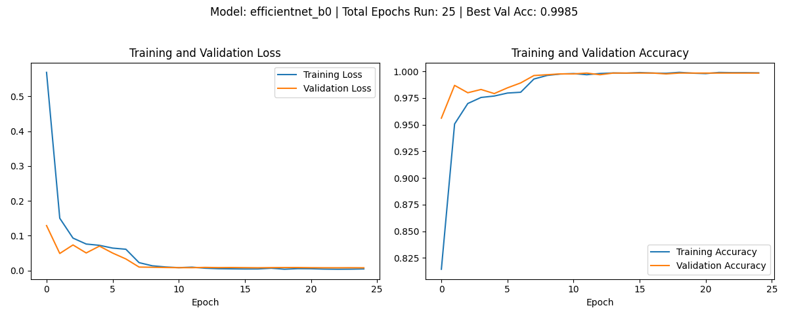
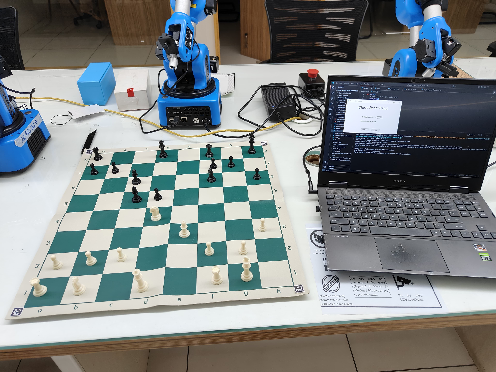
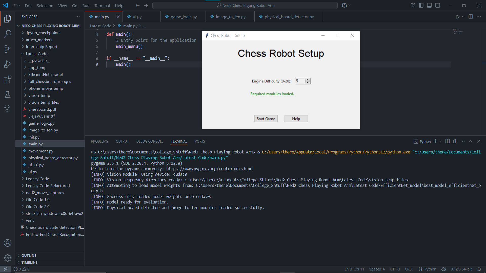
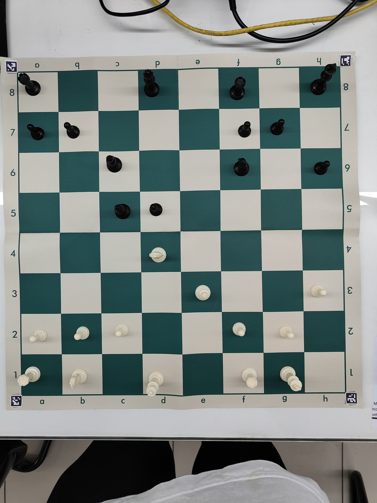
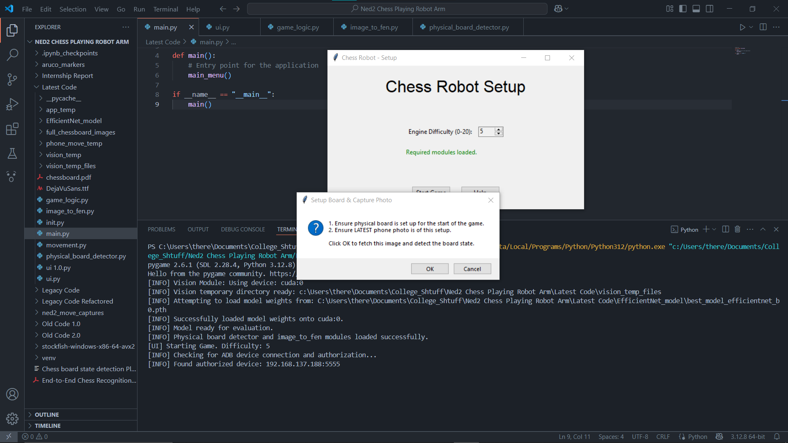
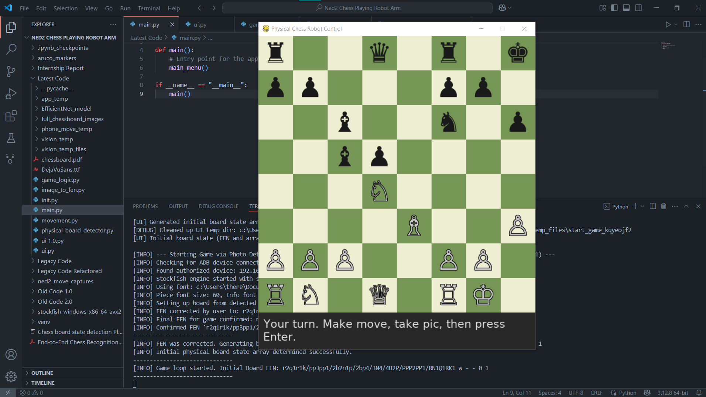
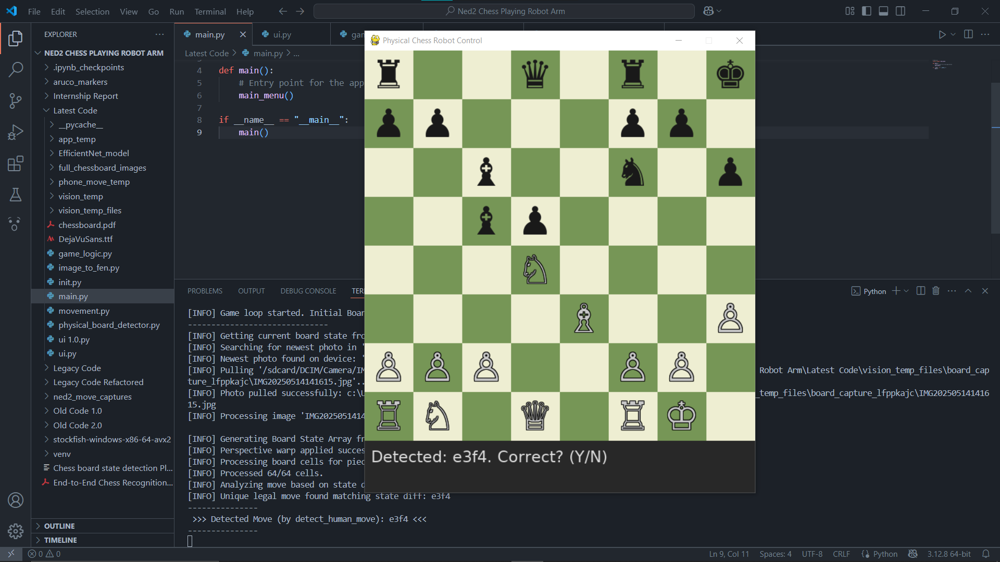
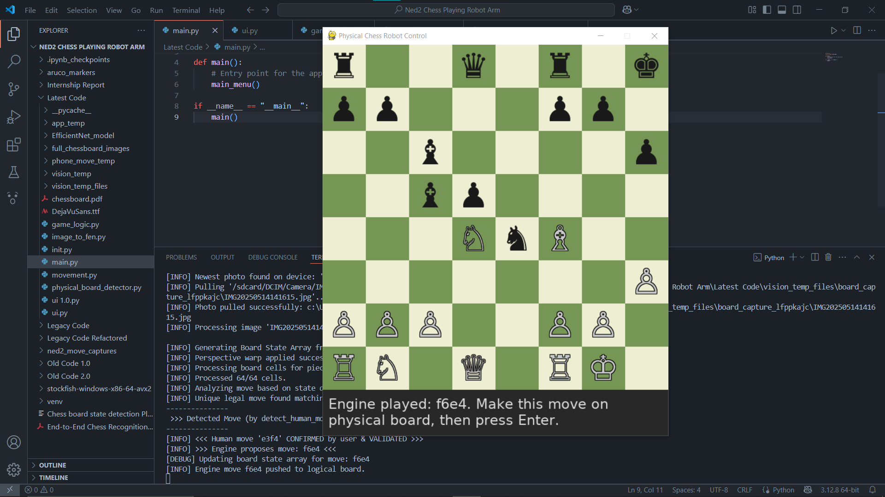

# CNN for Accurately Detecting Chess Board State

## Background

This project was built as a feature for a larger project, i.e., a chess playing robot using the Niryo Ned2 so that a human user can play against the robot as if it were another human, picking up and placing the physical chess pieces. 

The biggest obstacle in building this was figuring out a way to accurately predict both the chess pieces on the board and their respective positions. There are a few public projects that use yolo models or other ML models which can identify the chess pieces in an image. However, they have no way of identifying the positions of thoes pieces. Moreover, a shortcoming of those models is that they are highly specific to the specific type of chess pieces and chessboards used. As for predicting the position of the pieces, there are even fewer publicly available projects detailing how this can be implemented. 

Due to the unavailability of such a project to fit my needs, I came up with a pipeline for creating a cnn model that can accurately predict both chess pieces and their respective positions from a single image of a chessboard. While the model that I have trained is highly specific to my own chess pieces, chess board and lighting, the methodology and pipeline I used for collecting the data, labeling it and training the model is easily adaptable to any type of chess pieces and chess boards. For my configuration, I was able to train a EfficientNet model to achieve a accuracy of 98.5%. 



I expect that if another researcher were to use much more diverse data set than mine, they could achieve a similar accuracy while still being more tolerant to a larger diversity of chess pieces, chess boards and lighting conditions.


## Setup

Ensure Android Debug Bridge Utility (ADB) and Python3 is installed. You can use [this](https://www.howtogeek.com/125769/how-to-install-and-use-abd-the-android-debug-bridge-utility/) guide for installing ADB.

Install the following libraries for python. I have also provided the pip commands for the same.

- Pygame: Used for creating the game interface and graphics. 
```
pip install pygame
```
- python-chess: Used for chess logic, board representation, and move validation. 
```
pip install python-chess
```
- NumPy: Used for numerical operations, particularly for board state arrays. 
```
pip install numpy
```
- OpenCV (cv2): Used for image processing, such as detecting ArUco markers and warping the chessboard image. You will also need the contributions package for ArUco markers: 
```
pip install opencv-python
```
```
pip install opencv-contrib-python
```
- PyTorch (torch): Used for the machine learning model that identifies chess pieces from images. Installation instructions for PyTorch vary based on your system and CUDA version (if you have a GPU). Please visit the Official PyTorch website to get the appropriate command for your setup. A typical CPU-only command is: 
```
pip install torch torchvision torchaudio
```
- timm: PyTorch Image Models library, used in conjunction with PyTorch for the image classification model. 
```
pip install timm
```
- Pillow (PIL): Used for image manipulation. 
```
pip install Pillow
```
- Tkinter: This is typically included with standard Python installations. However, on some Linux systems, you might need to install it separately. 
- I have also used the following libraries which are part of the Python standard library and do not require separate installation:
    - time
    - os 
    - subprocess
    - tempfile
    - shutil
- Stockfish Engine and the DejaVuSans ttf file are both included with this repo, just replace the path to these files with the path on your local machine when running the scripts.

I have included the aruco markers as well in this repo. Download those and print them out. Put one of the markers on each of the 4 outside corners of the chessboard. Ensure that the orientation of the markers is preserved as they were in the file when you paste them onto the board. Marker 0 goes to the top left corner, marker 1 to the top right, marker 2 to the bottom right and marker 3 to the bottom left. Also make sure that there is atleast a small white border around the marker and that the black innermost edge of each marker is exactly at the outermost edge of each chess board corner. Here is a reference image of what it should look like:




## Running the Game Itself

I have included a separate read me file in the Data folder if you would like to just use the pipeline by itself for your own use. The rest of this read me is for running the game itself.

Make sure all the python scripts are saved in the same folder. Also ensure that the DejaVuSans.ttf, Stockfish Engine and the trained EfficientNet model paths in the scripts are replaced with their actual paths on your local machine.

Scripts included in this repo apart from Data:
- main.py: Just the starting point for the script.
- ui.py: Deals with all of the GUI.
- game_logic.py: Handles all game logic and the script where the PyGame loop runs.
- image_to_fen.py: Module that handles converting an image of the chessboard into fen.
- physical_board_detector.py: Handles creation of occupancy array.
- aruco_markers.py: Just a script used to generate the ArUco markers. You do not need to run it.

Connect your android phone to your machine via USB and run the following command, it should output a list of devices connected:
```
adb devices
```
Enable TCP/IP Mode for ADB: With the phone connected via USB, run the command (You can use a different port number if 5555 is in use): 
```
adb tcpip 5555
```
Disconnect the USB cable and ensure that your phone is connected to the same Wi-Fi as your machine. Go on your phone and the Wi-Fi settings to find the IP address of your phone on the network (e.g., 192.168.1.x)

Now to connect ADB wirelessly, run the following command:
```
adb connect <your_phone_ip_address>:5555
```
Verify the wireless connections by running ``` adb devices ``` again. You should see your phone listed with its IP address and port.

Now run the main.py script, it should launch the main menu.



Take a high quality top down picture with white's side toward you. Here is an example of what a picture should look like:



Press start game, the game will launch the ML model and open PyGame to start the game. 



It will retrieve the latest photo from your Camera Gallery, which is the one you just took, automatically crop it into 64 images (one for each cell) and pass it into the model to get the prediction for each cell and will reconstruct the full chess board state from this. 



Then it will ask you to play your move and take another picture. It uses this second picture to find the difference in chess board states to figure out the move played. If the move played is valid, it will ask you to confirm that its prediction is true. If it is not able to detect it correctly twice, then for the 3rd time, it will ask you to enter the move manually in the window.



After your move is played, the chess board in the window will update and the engine will play its move and display it so that you can move the piece for it. You need to press enter after moving it to confirm it after which it will switch back to white's (user's) turn again. 



Please keep in mind that this is the first prototype of this app and so there are bound to be bugs some of which could be game breaking. I have only tested this app on my personal laptop (Windows 10, Ryzen 7 5800H, RTX 3060 Laptop GPU) and phone (OnePlus 11R).